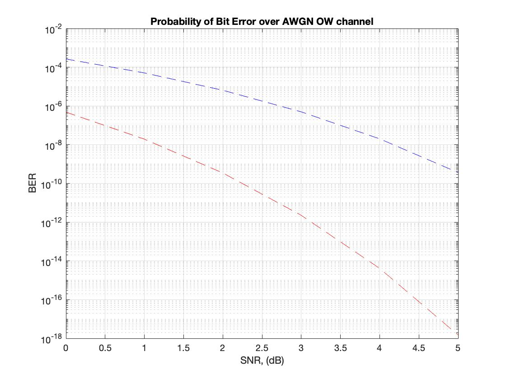
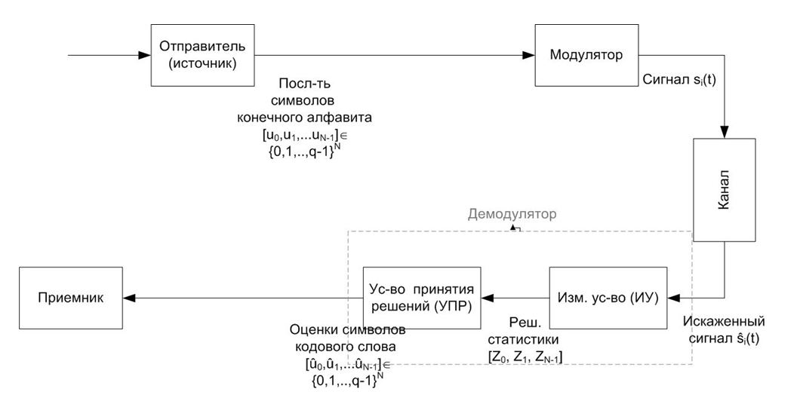

# PPM_optiacal_channel
Modelling Simple OWC channel
#### Coursework
#### Name: Zhornichenko Ilya Alekseevich
#### Group: TMSS

- This repository contains of methods which creates the model of simple OWC channel using AWGN noise model.

### BER vs SNR characteristics

### Simple model of OWC channel with HDD and SDD

**Zhornichenko Ilya**
